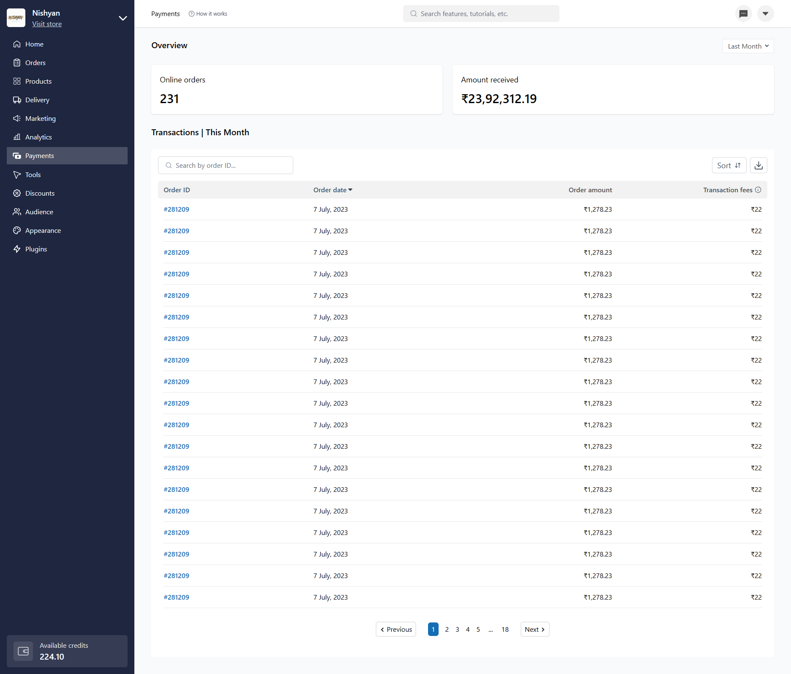

# Dukaan Frontend Engineer Internship Assessment

Welcome to the frontend engineer internship assessment for Dukaan! This repository contains a React Vite application built to fulfill the requirements of the assessment. The project utilizes various technologies such as React Icons, React Paginate, and Tailwind CSS.

**Assessment (Figma Design):**
[Dukaan Assignment tweet (Payouts V2 - 2023)](https://twitter.com/subhashchy/status/1744308069751025894?t=07R6p4n89mn5Vr7tKXvaGA&s=19)

## Project Overview

The project aims to replicate the provided Figma design using React Vite. It includes features like pagination, and it's styled using Tailwind CSS for responsive and modern UI design. React Icons are used for adding icons throughout the application.

## [**LIVE SITE**](https://dukaan-payment.netlify.app/) | [DEMO VIDEO](https://youtu.be/JvvM8Vql3ks)

## Screen



## Technologies Used

- React.js
- Vite
- React Icons
- React Paginate
- Tailwind CSS

## Local Installation

To run this project locally, follow these steps:

### Prerequisites

- Node.js and npm should be installed on your machine.

## Installation:

1. Clone the repository:

   ```bash
   git clone https://github.com/Abhijitkr/Dukaan-Assignment.git
   ```

2. Navigate to dukaan-assignment

   ```bash
   cd dukaan-assignment
   ```

3. Install Dependencies

   ```bash
   npm install
   ```

4. Run the application

   ```bash
   npm run dev
   ```

The development server will start, and you can access the application by visiting `http://localhost:5173` in your web browser.

## Contact

If you have any questions or just want to connect below are my contacts [Twitter(X)](https://twitter.com/AbhijitKrM), [LinkedIn](https://www.linkedin.com/in/abhijitkrma/).

### Happy Coding!
